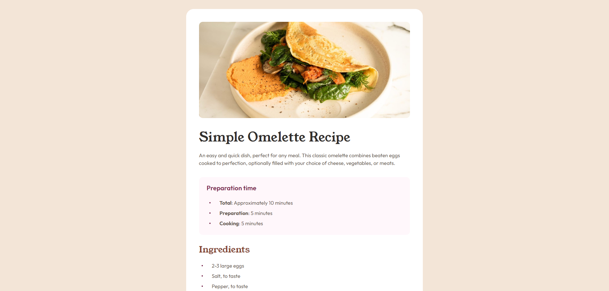
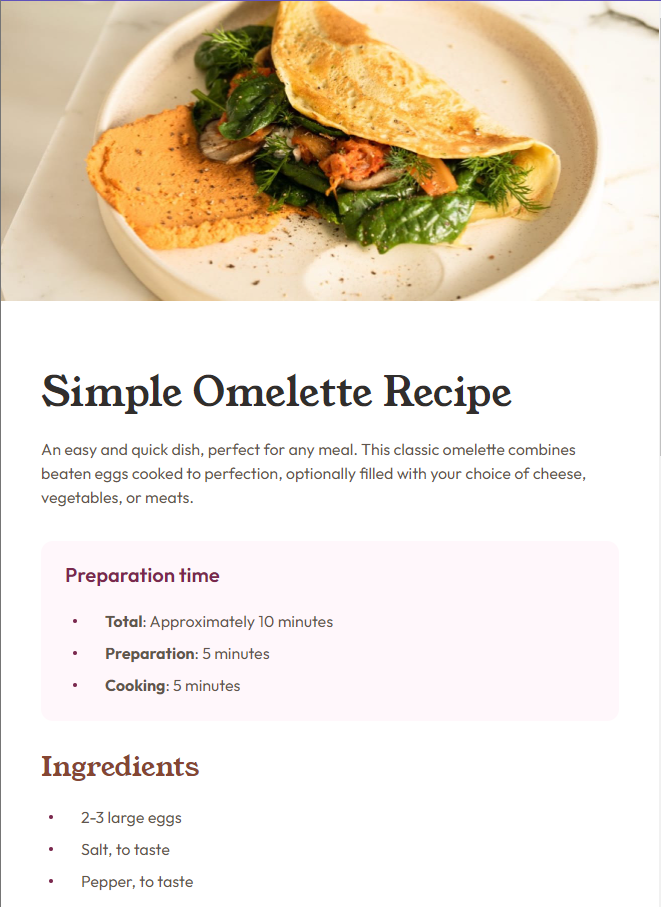

# Frontend Mentor - Recipe page solution

This is a solution to the [Recipe page challenge on Frontend Mentor](https://www.frontendmentor.io/challenges/recipe-page-KiTsR8QQKm).

## Table of contents

- [Overview](#overview)
  - [Screenshot](#screenshot)
  - [Links](#links)
- [My process](#my-process)
  - [Built with](#built-with)
  - [What I learned](#what-i-learned)
- [Author](#author)

## Overview

### Screenshot




### Links

- Solution URL: [Click Me](https://github.com/shakthivel-rn/recipe-page)
- Live Site URL: [Click Me](https://shakthivel-rn.github.io/recipe-page/)

## My process

### Built with

- HTMl
- CSS
- Flexbox

### What I learned

- I learned how make the website responsive for mobile layout using media queries

```css
@media (max-width: 768px) {
  .card {
    width: 100%;
    padding: 0;
    border-radius: 0;
  }

  .card img {
    border-radius: 0;
  }

  body {
    padding: 0;
  }

  .text-content {
    padding: var(--spacing-400) var(--spacing-500);
  }
}
```

## Author

- Website - [Shakthivel Ramesh Nirmala](https://shakthivel-portfolio.vercel.app/)
- Frontend Mentor - [@shakthivel-rn](https://www.frontendmentor.io/profile/shakthivel-rn)
